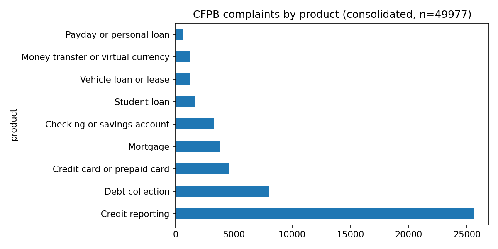

# Financial Complaint Classification: TF-IDF vs. Fine-tuned Transformer vs. LLM Prompting

Given the free-text narrative of a consumer complaint filed with the CFPB, predict which financial product it is about (9 classes). Three approaches are compared on the same 5,000-row hold-out set: a TF-IDF + logistic regression baseline, a fine-tuned DistilBERT, and zero-shot / few-shot prompting of Claude Haiku 4.5. Each is scored on macro-F1, accuracy, training time, and inference cost.

Notebook: `CFPB_NLP_OneClick.ipynb` (runs end to end on a Colab T4; the Claude section needs an API key in Colab Secrets). Result files (`results_table.md`, `all_results.json`, per-row predictions in `test_predictions.csv` and `test_pred_llm.csv`) sit at the repo root.

## Data

Consumer Financial Protection Bureau, Consumer Complaint Database (public domain, CC0), read from the Hugging Face mirror `davidheineman/consumer-finance-complaints-large` because the CFPB file server rejects cloud-notebook IPs. Two parquet shards (2015 to 2024), rows with a consumer narrative, random sample of 50,000 (49,977 after cleaning). Narratives are already redacted by CFPB (names and numbers replaced with XXXX).

CFPB renamed its product taxonomy several times, so the raw labels carried 21 variants (three flavors of "credit reporting", two of "credit card", three of "payday loan"). These were consolidated into 9 classes; two tiny leftovers ("Debt or credit management", "Other financial service", 23 rows) were dropped.



Class imbalance is severe: credit reporting is 51% of the sample, payday/personal loans 1.2%. That is why macro-F1, not accuracy, is the headline metric.

## Methods

1. **Baseline**: TF-IDF (1-2 grams, 100K features, sublinear tf) + logistic regression with balanced class weights, 5-fold CV on the 45K training rows.
2. **Fine-tuned Transformer**: `distilbert-base-uncased`, max 256 tokens, 2 epochs, lr 3e-5, fp16 on a Colab T4. Run once on 15K rows, then on the full 45K.
3. **LLM prompting**: Claude Haiku 4.5 on a 500-row subset of the test set, three prompt versions: (v1) zero-shot with the label list, (v2) zero-shot plus a one-sentence definition per category, (v3) five-shot with one labeled example per class. All three end with "Answer with the category name only."

## Results

| Method                                    |   Macro-F1 |   Accuracy | Training time   | Inference cost   |
|:------------------------------------------|-----------:|-----------:|:----------------|:-----------------|
| TF-IDF + LogReg (45K rows)                |      0.748 |      0.842 | 1.6 min (CPU)   | ~$0              |
| DistilBERT fine-tuned (15K rows, 2 ep)    |      0.721 |      0.839 | 3 min (T4 GPU)  | ~$0              |
| **DistilBERT fine-tuned (45K rows, 2 ep)** |  **0.752** |  **0.857** | 9 min (T4 GPU)  | ~$0              |
| Claude Haiku 4.5 zero-shot (500 rows)     |      0.685 |      0.814 | none            | $0.33 per 1K     |
| Claude Haiku 4.5 + definitions (500 rows) |      0.676 |      0.822 | none            | $0.53 per 1K     |
| Claude Haiku 4.5 five-shot (500 rows)     |      0.682 |      0.822 | none            | $0.98 per 1K     |

Per-class baseline F1 ranged from 0.90 (credit reporting) and 0.88 (mortgage) down to 0.56 (vehicle loan) and 0.42 (payday/personal loan, 61 test rows).

## What I found

**Training data beat model size.** DistilBERT trained on 15K rows lost to TF-IDF trained on 45K (0.721 vs 0.748). Given the same 45K rows it moved ahead on both metrics (0.752 F1, 0.857 accuracy). The first comparison would have led to the wrong conclusion; matching the training set was the fix.

**The LLM's ceiling was the output parser, not the prompt.** The first LLM run used a parser that returned the first label *in list order* found anywhere in the reply. Few-shot prompting made the model verbose (11,233 output tokens vs 2,981 for zero-shot) and that parser then favored alphabetically early classes, dragging few-shot macro-F1 down to 0.533. Two changes recovered it: a parser that takes the label appearing *earliest in the reply*, and the same "answer with the category name only" instruction on every prompt. Output tokens fell to about 3,000 for all three versions and few-shot F1 rose to 0.682. Run 1 is kept in `results_table_run1_naive_parser.md`.

| Run 1, naive parser        |   Macro-F1 |   Accuracy |   Output tokens |
|:---------------------------|-----------:|-----------:|----------------:|
| zero-shot                  |      0.695 |      0.824 |            2981 |
| + definitions              |      0.626 |      0.820 |            3014 |
| five-shot                  |      0.533 |      0.818 |           11233 |

**Richer prompts bought a little accuracy, no macro-F1.** Definitions and examples lifted accuracy from 0.814 to 0.822 but left macro-F1 flat (0.68 to 0.69) at two to three times the cost per record. The rare classes are where the LLM struggles, and a prompt cannot give it the 500-plus labeled payday-loan examples the fine-tuned model saw.

**Which method when.** For a fixed, well-labeled taxonomy at scale, the fine-tuned model wins on quality and is free to run once trained; TF-IDF is a strong cheap baseline that is hard to beat without enough data. Zero-shot prompting is the right tool when there are no labels yet, the taxonomy changes often, or volume is small enough that $0.33 per 1K records does not matter.

## What I'd do next

- Error analysis on the confused pairs (credit card vs. debt collection, checking vs. money transfer) and a confusion matrix per method.
- Predict `consumer_disputed` as a second target, which is the business question a bank cares about.
- Threshold tuning or focal loss for the two rare classes.
- A small Streamlit demo that takes a complaint and returns the category from the fine-tuned model.

## Run

Open `CFPB_NLP_OneClick.ipynb` in Google Colab, set the runtime to T4 GPU, add `ANTHROPIC_API_KEY` under Secrets (optional; section 4 is skipped without it), then Runtime → Run all. About 60 minutes end to end.

```
pip install -r requirements.txt
```
